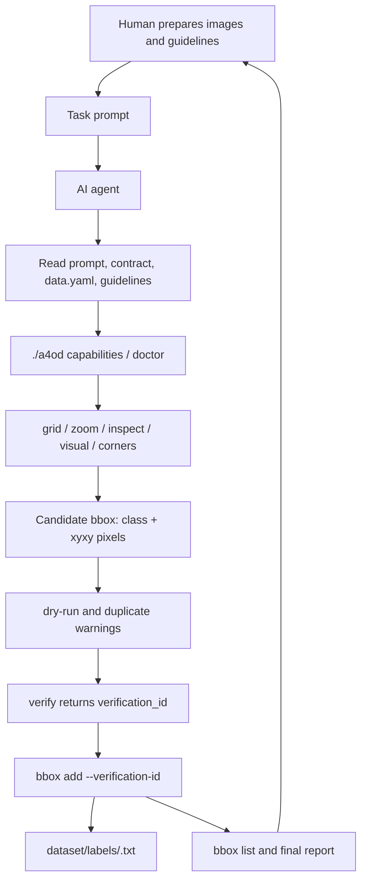

# A4OD: Agent-First YOLO Annotation Toolkit

A4OD provides a CLI contract for AI agents that create YOLO object-detection
labels. The intended workflow is agent-first: a human prepares images and
labeling rules, then asks an AI agent to annotate through the public `./a4od`
interface.

The repository does not claim annotation accuracy, token savings, or model
performance. Those must be measured separately for each dataset and agent.

## What Humans Need To Know

- Put images to annotate in `data/`.
- Define classes in `dataset/data.yaml`.
- Define labeling rules in `dataset/labeling_guidelines.md`.
- Ask an AI agent to use `prompt/ai_annotation_prompt.md`.
- Review the final YOLO labels in `dataset/labels/` and the generated inspection
  artifacts in `tmp/<image_stem>/`.

Example task for one image:

```text
Use prompt/ai_annotation_prompt.md to label data/12447.png.
```

Example task for a batch:

```text
Use prompt/ai_annotation_prompt.md to annotate all images in data/.
```

Humans should not edit YOLO `.txt` label files directly. If a result is wrong,
update the guideline or ask the agent to revise the affected image.

## Agent Workflow

The AI agent reads:

```text
prompt/ai_annotation_prompt.md
TOOL_CONTRACT.md
.a4od/contract.yaml
dataset/data.yaml
dataset/labeling_guidelines.md
```

Then it follows this workflow through `./a4od`:

```text
doctor
  -> bbox list
  -> grid
  -> zoom when needed
  -> inspect / visual / corners
  -> bbox add --dry-run
  -> verify
  -> bbox add --verification-id
  -> bbox list
```

`bbox add` requires a fresh `verification_id` from `verify`, unless `--force`
is explicitly used. This keeps label mutation behind a CLI gate instead of
allowing an agent to write `.txt` files directly.

## Repository Layout

```text
A4OD/
├── a4od                       # Public CLI wrapper for agents
├── annotation.py              # Backward-compatible CLI entrypoint
├── .a4od/
│   └── contract.yaml          # Machine-readable API/CLI contract
├── schemas/                   # JSON schemas for core command outputs
├── requirements.txt           # Python dependencies
├── src/                       # Core implementation
├── dataset/
│   ├── data.yaml              # Class ids and names
│   ├── labeling_guidelines.md # Dataset-specific labeling rules
│   ├── labeling_guidelines_example.md
│   └── labels/                # YOLO labels written by the CLI
├── data/                      # Images to annotate
├── prompt/
│   └── ai_annotation_prompt.md
├── tests/
└── tmp/                       # Generated grid/zoom/inspection artifacts
```

## Dataset Setup

1. Add images:

```text
data/12447.png
```

2. Define classes:

```yaml
path: .
train: images
val: images
names:
  0: traffic_sign
nc: 1
```

3. Define labeling rules:

```text
dataset/labeling_guidelines.md
```

For a new domain, start from:

```text
dataset/labeling_guidelines_example.md
```

Keep the class sections aligned with `dataset/data.yaml`. The CLI rejects class
names that are not present in the dataset config.

## Agent Architecture



## Public Contract For Agents

Humans usually do not need to call these commands during normal annotation.
They exist so agents can discover and use the tool without reading source code.

```bash
./a4od --version
./a4od capabilities
./a4od schema
```

Contract files:

```text
TOOL_CONTRACT.md
.a4od/contract.yaml
schemas/*.v1.json
```

## Installation

```bash
python3 -m venv .venv
source .venv/bin/activate
pip install -r requirements.txt
```

## Developer Checks

These commands are for maintainers and implementation changes. They are not part
of the normal human annotation workflow.

```bash
.venv/bin/python -m unittest discover tests
./a4od doctor --data dataset/data.yaml --run-smoke
./a4od capabilities
```

## References

- [AI Annotation Prompt](prompt/ai_annotation_prompt.md)
- [Tool Contract](TOOL_CONTRACT.md)
- [Labeling Guidelines](dataset/labeling_guidelines.md)
- [Labeling Guidelines Example](dataset/labeling_guidelines_example.md)
