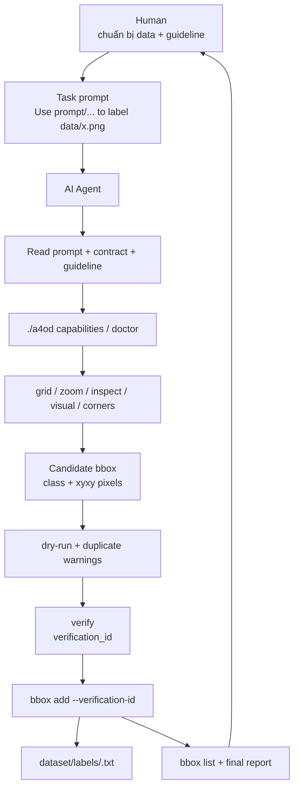
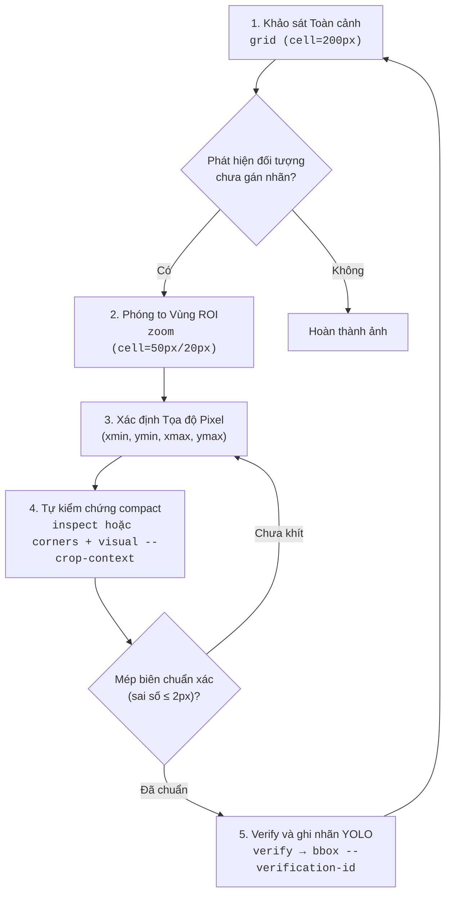

# A4OD: AI-Assisted Object Detection & YOLO Annotation Tool

[](https://www.python.org/)
[](LICENSE)
[](tests/)

**A4OD** (AI-Assisted Annotation for Object Detection) là bộ công cụ CLI và thư viện Python chuyên biệt hỗ trợ các mô hình AI Vision / Multi-modal LLM (như Gemini, Claude, GPT-4o, Codex) tự động hóa quy trình phát hiện đối tượng và gán nhãn dataset theo chuẩn **YOLO**.

Công cụ áp dụng phương pháp **Coarse-to-Fine (Lưới thưa $\to$ Zoom mịn)** kết hợp **Corner Inspection (Soi 4 góc vi sai)**, giúp đạt độ chính xác tuyệt đối tới từng pixel đồng thời **tiết kiệm 60% – 85% Vision Tokens**.

---

## 🌟 Tính Năng Nổi Bật

- 📐 **Lưới Toàn Cảnh Kèm Thước Đo (`grid`)**: Kẻ lưới pixel (mặc định 200px) kèm thước đo trục X/Y và các vạch chia phụ 50px (sub-ticks), tự động hiển thị các nhãn đã có (màu xanh lá) để tránh gán trùng lặp.
- 🔍 **Phóng To Vùng Quan Tâm Giữ Tọa Độ Thực (`zoom`)**: Cắt vùng ROI và phủ lưới mịn (50px, 20px, 10px, 5px) nhưng **giữ nguyên hệ tọa độ ảnh gốc (Global Coordinates)** trên thước đo. AI đọc trực tiếp tọa độ mà không cần tính toán cộng/trừ offset.
- 🎯 **Soi 4 Góc Mép Viền Siêu Nhẹ Token (`corners`)**: Cắt 4 góc của BBox (`[TL]`, `[TR]`, `[BL]`, `[BR]`) và ghép thành ảnh composite siêu nhỏ (~160x160px, chỉ tốn ~60 tokens) để kiểm tra độ khít của mép biên.
- 👁️ **Trực Quan Hóa BBox Ứng Viên (`visual`)**: Render BBox ứng viên do AI đề xuất (viền đỏ đậm) cùng các nhãn đã có (viền xanh lá) trên toàn cảnh ảnh.
- 🏷️ **Quản Lý Nhãn YOLO Hoàn Toàn Tự Động (`bbox`)**: Thêm (`add`), xóa (`delete`), xem danh sách (`list`) nhãn trong file `.txt`. Tự động chuyển đổi giữa tọa độ pixel `(xmin, ymin, xmax, ymax)` và định dạng YOLO normalized `(x_center, y_center, width, height)`.
- ⚡ **Thuần Python, Nhẹ & Nhanh**: Xây dựng trên `Pillow` và `PyYAML`, không phụ thuộc các thư viện nặng như OpenCV hay GUI frameworks.

---

## 📁 Cấu Trúc Dự Án

```text
A4OD/
├── a4od                       # Public CLI cho AI agent
├── annotation.py              # CLI Entrypoint chính (grid, zoom, corners, visual, bbox)
├── .a4od/
│   └── contract.yaml          # Machine-readable contract cho agent
├── schemas/                   # JSON schema cho output/contract lõi
├── requirements.txt           # Dependencies (Pillow, PyYAML)
├── src/                       # Mã nguồn xử lý lõi
│   ├── __init__.py
│   ├── config.py              # Xử lý data.yaml và mapping đường dẫn ảnh <-> nhãn
│   ├── coords.py              # Chuyển đổi tọa độ (Pixel XYXY <-> YOLO Normalized XYWH)
│   ├── yolo_io.py             # Đọc, ghi và xóa nhãn .txt chuẩn YOLO
│   ├── grid_renderer.py       # Render lưới pixel toàn cảnh và thước đo
│   ├── zoom_renderer.py       # Render ROI zoom lưới mịn giữ Global Coordinates
│   ├── corner_inspector.py    # Cắt ghép 4 góc BBox (TL, TR, BL, BR) siêu nhẹ token
│   └── visualizer.py          # Render preview bbox ứng viên toàn cảnh
├── dataset/                   # Dataset mẫu & cấu hình nhãn
│   ├── data.yaml              # Cấu hình dataset và danh sách class
│   ├── labeling_guidelines.md # Quy chuẩn gán nhãn chi tiết cho từng class
│   └── labels/                # Thư mục nhãn YOLO (.txt) được tạo từ ảnh trong data/
├── data/                      # Thư mục đặt ảnh cần gán nhãn
├── prompt/                    # Prompts chuẩn hóa cho AI Vision Agent
│   └── ai_annotation_prompt.md # System Prompt & Task Prompt Coarse-to-Fine
├── tests/                     # Bộ Unit Tests & Integration Tests
│   ├── test_coords.py
│   ├── test_config.py
│   ├── test_yolo_io.py
│   ├── test_zoom.py
│   ├── test_corners.py
│   └── test_cli.py
└── tmp/                       # Ảnh render tạm theo từng ảnh: tmp/<image_stem>/...
```

---

## 🚀 Cài Đặt & Khởi Chạy

### Yêu Cầu
- Python >= 3.8

### Cài Đặt Môi Trường

```bash
# 1. Tạo và kích hoạt môi trường ảo
python3 -m venv .venv
source .venv/bin/activate    # Trên Linux/macOS
# hoặc .venv\Scripts\activate trên Windows

# 2. Cài đặt các gói phụ thuộc
pip install -r requirements.txt
```

---

## 🧭 Human Workflow: Dùng AI Để Label

A4OD được thiết kế để **human không phải tự đọc grid, tự tính bbox, hoặc tự
sửa file YOLO**. Human chuẩn bị dataset và giao nhiệm vụ cho AI agent. AI agent
đọc prompt/contract/guideline rồi tự chạy CLI để label.

### 1. Chuẩn Bị Dataset

1. Đặt ảnh cần label vào `data/`.

```text
data/12447.png
```

2. Khai báo class trong `dataset/data.yaml`.

```yaml
path: .
train: images
val: images
names:
  0: traffic_sign
nc: 1
```

3. Ghi rõ quy tắc gán nhãn trong `dataset/labeling_guidelines.md`.

Khi tái sử dụng A4OD cho một loại đối tượng hoặc domain mới, mục tiêu là chỉ
cần thay hai file:

```text
dataset/data.yaml                 # class id / class name source of truth
dataset/labeling_guidelines.md    # semantic annotation rules
```

Hãy copy `dataset/labeling_guidelines_example.md` thành
`dataset/labeling_guidelines.md` rồi điền lại các section theo domain mới.
Giữ nguyên cấu trúc heading trong file mẫu để AI agent đọc được rule một cách
ổn định. Class trong `labeling_guidelines.md` phải khớp chính xác với
`dataset/data.yaml`; CLI sẽ từ chối class lạ thay vì tự tạo class id mới.

File guideline phải mô tả chính xác:
- class nào được label;
- trường hợp nào phải bỏ qua;
- cách vẽ bbox;
- quy tắc xử lý occlusion, blur, truncation, ambiguity.

### 2. Giao Việc Cho AI

Label một ảnh:

```text
Use prompt/ai_annotation_prompt.md to label data/12447.png.
```

Label toàn bộ thư mục:

```text
Use prompt/ai_annotation_prompt.md to annotate all images in data/.
```

AI agent sẽ tự đọc:

```text
prompt/ai_annotation_prompt.md
TOOL_CONTRACT.md
.a4od/contract.yaml
dataset/data.yaml
dataset/labeling_guidelines.md
```

Sau đó agent tự chạy pipeline:

```text
doctor
  -> bbox list
  -> grid
  -> zoom khi cần
  -> inspect / visual / corners
  -> bbox add --dry-run
  -> verify
  -> bbox add --verification-id
  -> bbox list
```

### 3. Human Kiểm Tra Kết Quả

Sau khi AI báo cáo xong, human kiểm tra nhanh:

```bash
./a4od bbox data/12447.png --action list --data dataset/data.yaml
```

Mở các ảnh kiểm chứng do agent tạo:

```text
tmp/<image_stem>/
```

Human chỉ nên can thiệp ở mức guideline/dataset hoặc yêu cầu AI sửa lại bbox.
Không sửa file label `.txt` trực tiếp.

## 🧱 Kiến Trúc Agent-First

A4OD chia rõ vai trò:

- **Human**: chuẩn bị ảnh, class, guideline; giao task; review kết quả.
- **AI agent**: đọc prompt/contract/guideline; quan sát ảnh qua CLI; đề xuất bbox;
  verify; ghi label.
- **A4OD CLI**: cung cấp công cụ quan sát, contract JSON, verification gate, và
  ghi YOLO label an toàn.
- **Dataset**: ảnh đầu vào, guideline, labels YOLO, và optional visual examples.



## 🔒 Agent Contract

Human thường **không cần gọi trực tiếp** các lệnh dưới đây. Đây là public API
để AI agent dùng ổn định mà không đọc source code.

Nguồn contract:

```text
TOOL_CONTRACT.md
.a4od/contract.yaml
schemas/*.v1.json
```

CLI public:

```bash
./a4od --version
./a4od capabilities
./a4od schema
```

Mutation gate:

```text
bbox add requires a fresh verification_id from verify.
--force exists only for explicit bypass workflows and returns a warning.
```

---

## 🔄 Pipeline Nội Bộ Của AI Agent



---

## 🧪 Developer Testing

Phần này dành cho người phát triển hoặc maintainer kiểm tra contract và test
suite. Human chỉ dùng A4OD để giao task label thì không cần chạy các lệnh này
trong workflow hằng ngày.

```bash
# Kích hoạt venv và chạy toàn bộ test suite
.venv/bin/python -m unittest discover tests

# Kiểm public contract
./a4od doctor --data dataset/data.yaml --run-smoke
./a4od capabilities
./a4od verify data/59.png traffic_sign 214 320 267 362 --data dataset/data.yaml
```

---

## 📖 Tài Liệu Tham Khảo

- **[AI Annotation Prompt](prompt/ai_annotation_prompt.md)**: System Prompt và Task Prompt tối ưu cho Agent Vision.
- **[Labeling Guidelines](dataset/labeling_guidelines.md)**: Quy chuẩn định nghĩa và quy tắc phân biệt nhãn chi tiết.
- **[Labeling Guidelines Example](dataset/labeling_guidelines_example.md)**: Template guideline domain-agnostic để tái sử dụng repo cho object mới.
- **[Tool Contract](TOOL_CONTRACT.md)**: Contract CLI/API cho AI agent.
