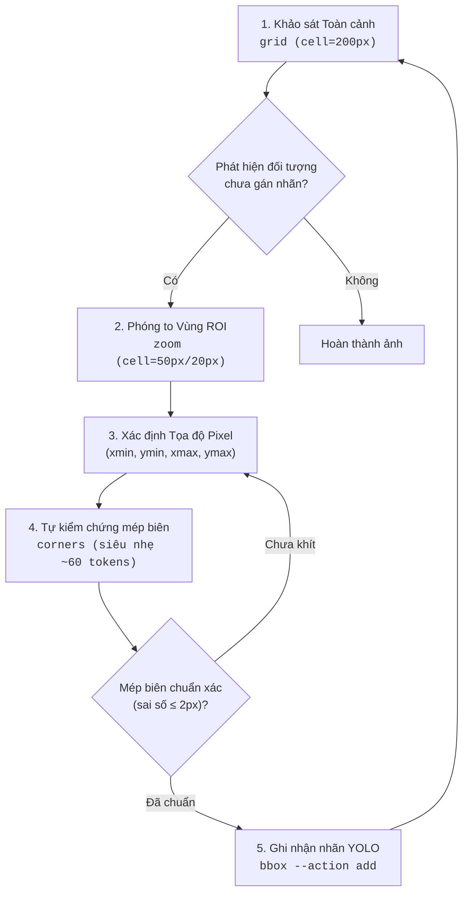

# A4OD: AI-Assisted Object Detection & YOLO Annotation Tool

[](https://www.python.org/)
[](LICENSE)
[](tests/)

**A4OD** (AI-Assisted Annotation for Object Detection) là bộ công cụ CLI và thư viện Python chuyên biệt hỗ trợ các mô hình AI Vision / Multi-modal LLM (như Gemini, Claude, GPT-4o, Codex) tự động hóa quy trình phát hiện đối tượng và gán nhãn dataset theo chuẩn **YOLO**.

Công cụ áp dụng phương pháp **Coarse-to-Fine (Lưới thưa $\to$ Zoom mịn)** kết hợp **Corner Inspection (Soi 4 góc vi sai)**, giúp đạt độ chính xác tuyệt đối tới từng pixel đồng thời **tiết kiệm 60% – 85% Vision Tokens**.

---

## 🌟 Tính Năng Nổi Bật

- 📐 **Lưới Toàn Cảnh Kèm Thước Đo (`grid`)**: Kẻ lưới pixel (mặc định 200px) kèm thước đo trục X/Y và các vạch chia phụ 50px (sub-ticks), tự động hiển thị các nhãn đã có (màu xanh lá) để tránh gán trùng lặp.
- 🔍 **Phóng To Vùng Quan Tâm Giữ Tọa Độ Thực (`zoom`)**: Cắt vùng ROI và phủ lưới mịn (50px, 20px, 10px, 5px) nhưng **giữ nguyên hệ tọa độ ảnh gốc (Global Coordinates)** trên thước đo. AI đọc trực tiếp tọa độ mà không cần tính toán cộng/trừ offset.
- 🎯 **Soi 4 Góc Mép Viền Siêu Nhẹ Token (`corners`)**: Cắt 4 góc của BBox (`[TL]`, `[TR]`, `[BL]`, `[BR]`) và ghép thành ảnh composite siêu nhỏ (~160x160px, chỉ tốn ~60 tokens) để kiểm tra độ khít của mép biên.
- 👁️ **Trực Quan Hóa BBox Ứng Viên (`visual`)**: Render BBox ứng viên do AI đề xuất (viền đỏ đậm) cùng các nhãn đã có (viền xanh lá) trên toàn cảnh ảnh.
- 🏷️ **Quản Lý Nhãn YOLO Hoàn Toàn Tự Động (`bbox`)**: Thêm (`add`), xóa (`delete`), xem danh sách (`list`) nhãn trong file `.txt`. Tự động chuyển đổi giữa tọa độ pixel `(xmin, ymin, xmax, ymax)` và định dạng YOLO normalized `(x_center, y_center, width, height)`.
- ⚡ **Thuần Python, Nhẹ & Nhanh**: Xây dựng trên `Pillow` và `PyYAML`, không phụ thuộc các thư viện nặng như OpenCV hay GUI frameworks.

---

## 📁 Cấu Trúc Dự Án

```text
A4OD/
├── annotation.py              # CLI Entrypoint chính (grid, zoom, corners, visual, bbox)
├── requirements.txt           # Dependencies (Pillow, PyYAML)
├── src/                       # Mã nguồn xử lý lõi
│   ├── __init__.py
│   ├── config.py              # Xử lý data.yaml và mapping đường dẫn ảnh <-> nhãn
│   ├── coords.py              # Chuyển đổi tọa độ (Pixel XYXY <-> YOLO Normalized XYWH)
│   ├── yolo_io.py             # Đọc, ghi và xóa nhãn .txt chuẩn YOLO
│   ├── grid_renderer.py       # Render lưới pixel toàn cảnh và thước đo
│   ├── zoom_renderer.py       # Render ROI zoom lưới mịn giữ Global Coordinates
│   ├── corner_inspector.py    # Cắt ghép 4 góc BBox (TL, TR, BL, BR) siêu nhẹ token
│   └── visualizer.py          # Render preview bbox ứng viên toàn cảnh
├── dataset/                   # Dataset mẫu & cấu hình nhãn
│   ├── data.yaml              # Cấu hình dataset và danh sách class
│   ├── labeling_guidelines.md # Quy chuẩn gán nhãn chi tiết cho từng class
│   └── labels/                # Thư mục nhãn YOLO (.txt) được tạo từ ảnh trong data/
├── data/                      # Thư mục đặt ảnh cần gán nhãn
├── prompt/                    # Prompts chuẩn hóa cho AI Vision Agent
│   └── ai_annotation_prompt.md # System Prompt & Task Prompt Coarse-to-Fine
├── tests/                     # Bộ Unit Tests & Integration Tests
│   ├── test_coords.py
│   ├── test_config.py
│   ├── test_yolo_io.py
│   ├── test_zoom.py
│   ├── test_corners.py
│   └── test_cli.py
└── tmp/                       # Ảnh render tạm theo từng ảnh: tmp/<image_stem>/...
```

---

## 🚀 Cài Đặt & Khởi Chạy

### Yêu Cầu
- Python >= 3.8

### Cài Đặt Môi Trường

```bash
# 1. Tạo và kích hoạt môi trường ảo
python3 -m venv .venv
source .venv/bin/activate    # Trên Linux/macOS
# hoặc .venv\Scripts\activate trên Windows

# 2. Cài đặt các gói phụ thuộc
pip install -r requirements.txt
```

---

## 🧭 Chuẩn Bị Một Ảnh Để Gán Nhãn

Trước khi chạy CLI hoặc giao việc cho AI agent, chuẩn bị 3 phần sau:

1. Đặt ảnh cần label vào `data/`.

```text
data/12447.png
```

2. Khai báo class trong `dataset/data.yaml`.

```yaml
path: .
train: images
val: images
names:
  0: traffic_sign
nc: 1
```

3. Ghi rõ quy tắc gán nhãn trong `dataset/labeling_guidelines.md`.

File guideline phải mô tả chính xác:
- class nào được label;
- trường hợp nào phải bỏ qua;
- cách vẽ bbox;
- quy tắc xử lý occlusion, blur, truncation, ambiguity.

`annotation.py` dùng cấu trúc mặc định của repo như sau:

```text
data/<image_name>.png              # ảnh đầu vào
dataset/labels/<image_name>.txt    # nhãn YOLO được tạo bởi bbox add
tmp/<image_name>/...               # ảnh grid/zoom/corners/visual tạm thời
```

Không sửa file `.txt` label trực tiếp. Hãy dùng `annotation.py bbox`.

---

## 🛠️ Hướng Dẫn Sử Dụng CLI

### 1. Khảo Sát Toàn Cảnh (`grid`)
Tạo ảnh toàn cảnh với hệ thống thước đo pixel và lưới chia ô.

```bash
python annotation.py grid data/sample.png --cell-size 200 --data dataset/data.yaml
```
- **Tham số**:
  - `image_path`: Đường dẫn ảnh đầu vào.
  - `--cell-size`: Kích thước ô lưới (pixel), mặc định `200`.
  - `--data`: File cấu hình dataset (mặc định tự tìm `dataset/data.yaml`).
  - `--no-existing`: Ẩn các bounding box đã có sẵn.
- **Output**: Ảnh `tmp/<stem>/<stem>_grid.png` và thông tin metadata dạng JSON.

---

### 2. Phóng To Vùng Chi Tiết Giữ Tọa Độ Toàn Cục (`zoom`)
Cắt vùng ROI để quan sát vật thể nhỏ/xa với lưới chia siêu mịn.

```bash
python annotation.py zoom data/sample.png <xmin> <ymin> <xmax> <ymax> --cell-size 50 --data dataset/data.yaml
```
- **Tham số**:
  - `xmin ymin xmax ymax`: Tọa độ pixel vùng cần phóng to (theo hệ tọa độ ảnh gốc).
  - `--cell-size`: Bước lưới mịn (ví dụ: `50`, `20`, `10`, `5`).
- **Output**: Ảnh `tmp/<stem>/<stem>_zoom_<xmin>_<ymin>_<xmax>_<ymax>.png`.

---

### 3. Soi 4 Góc Mép Viền Siêu Tiết Kiệm Token (`corners`)
Cắt 4 miếng ảnh quanh 4 góc BBox để tự kiểm chứng độ khít của đường bao.

```bash
python annotation.py corners data/sample.png <xmin> <ymin> <xmax> <ymax> --patch-size 70
```
- **Tham số**:
  - `xmin ymin xmax ymax`: Tọa độ pixel của BBox ứng viên.
  - `--patch-size`: Kích thước mỗi góc (pixel), mặc định `70`.
- **Output**: Ảnh composite $2 \times 2$ `tmp/<stem>/<stem>_corners_....png` hiển thị các góc `[TL]`, `[TR]`, `[BL]`, `[BR]`.

---

### 4. Xem Trước Bounding Box Toàn Cảnh (`visual`)
Vẽ thử BBox ứng viên (màu đỏ) lên ảnh gốc để đánh giá trực quan.

```bash
python annotation.py visual data/sample.png <class_name_or_id> <xmin> <ymin> <xmax> <ymax> --data dataset/data.yaml
```
- **Output**: Ảnh `tmp/<stem>/<stem>_visual.png`.

---

### 5. Quản Lý File Nhãn YOLO (`bbox`)

#### Thêm Bounding Box Mới (`add`)
```bash
python annotation.py bbox data/sample.png traffic_sign 830 380 895 430 --action add --data dataset/data.yaml
```
*Tọa độ pixel sẽ tự động được chuẩn hóa sang format YOLO `(class_id, x_center, y_center, width, height)` và ghi vào file `.txt` tương ứng trong `dataset/labels/`.*

#### Xem Danh Sách Bounding Box Hiện Có (`list`)
```bash
python annotation.py bbox data/sample.png --action list --data dataset/data.yaml
```

#### Xóa Bounding Box Theo Index (`delete`)
```bash
python annotation.py bbox data/sample.png --action delete --index 0 --data dataset/data.yaml
```

---

## 🔄 Quy Trình Gán Nhãn Coarse-to-Fine Cho AI



---

## 🧪 Chạy Kiểm Thử (Testing)

Dự án đi kèm bộ kiểm thử tự động toàn diện (Unit Tests & Integration Tests):

```bash
# Kích hoạt venv và chạy toàn bộ test suite
.venv/bin/python -m unittest discover tests
```

---

## 📖 Tài Liệu Tham Khảo

- **[AI Annotation Prompt](prompt/ai_annotation_prompt.md)**: System Prompt và Task Prompt tối ưu cho Agent Vision.
- **[Labeling Guidelines](dataset/labeling_guidelines.md)**: Quy chuẩn định nghĩa và quy tắc phân biệt nhãn chi tiết.
